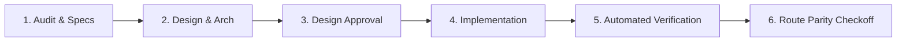

# [CUSTOMIZE: Project Name] — Autonomous Agents Governance & Engineering Manual

> **Document Status**: ACTIVE & ENFORCED  
> **Role**: Master Governance Blueprint for AI Agents, Pair Programmers, and Human Engineers  
> **Target Stack**: [CUSTOMIZE: target_stack, e.g., Next.js 15+, React 19, Tailwind CSS v4, TypeScript (Strict)]

---

## 1. Project Purpose & Scope

**[CUSTOMIZE: Project Name]** is a [CUSTOMIZE: project_description]. 
The project serves the following core missions:

1. **[CUSTOMIZE: Mission 1]**:
   - [CUSTOMIZE: Detail]
2. **[CUSTOMIZE: Mission 2]**:
   - [CUSTOMIZE: Detail]

---

## 2. Core Governance Principles

### 2.1 The Greenfield Rule

This is an uncompromising, fresh-slate engineering effort. **Zero legacy technical debt will be tolerated.** Every architectural pattern, component contract, hook, and route handler must be engineered according to modern best practices from inception. No legacy build hacks or temporary shortcuts.

### 2.2 Requirement to Inspect Docs Before Changing Architecture

Before creating or modifying any architecture, data contract, or core logic:
- Agents **MUST inspect** relevant documentation in `[CUSTOMIZE: docs_folder]`.
- No architectural assumptions or fabricated schemas are permitted.

### 2.3 Explicit Commit Authorization & Branch Safety Protocol

- **Never Commit Without Explicit Permission**: Agents and pair programmers must **NEVER execute `git commit` without explicit permission from the user**.
- **WARNING: Direct Commits to `main` Are Guarded**: Direct commits to the `main` branch are strictly prohibited without prior authorization.

---

## 3. The Generalized Engineering Rules

1. **Amplify Build Size Budget**: The production build output must remain strictly under defined size limits.
2. **Strict Backend-For-Frontend (BFF)**: Zero direct browser-to-backend calls. All network traffic routes through same-origin Route Handlers.
3. **Zero Global Runtime Monkey-Patching**: Never mutate or overwrite browser primitives (`window.fetch`, etc.). Use a scoped API client.
4. **Zero Authentication Tokens in Web Storage**: Manage sessions exclusively via encrypted `httpOnly`, `secure`, `sameSite: "lax"` cookies.
5. **Strict Secret Partitioning**: Never prefix private API keys with client-side exposure prefixes. Enforce build-time validation.
6. **Zero Hardcoded Test Credentials in Production**: Dummy credentials must never exist in production code.
7. **Strict Terminology Standard**: Ensure compliance with approved user-facing terminology rules.
8. **Mandatory Modal Background Scroll Lock**: Every overlay must lock background scroll on open and restore on unmount.
9. **Strict Accessibility (WCAG 2.1 AA)**: Semantic HTML only. Keyboard navigation and adequate touch targets are mandatory.
10. **Standardized URL Construction**: Resolve URLs using the standard `new URL(path, baseUrl)` constructor.
11. **Modular React Hooks (< 200 Lines)**: No custom hook may exceed 200 lines of code. Separate conflated concerns.
12. **SVG-as-Component Standard**: SVGs must be pure, optimized vectors authored as named React components with strict accessibility tags.
13. **Strict 500-Line File Ceilings**: Files and components must not exceed 500 lines unless strictly unavoidable.
14. **Zero Commits Without Permission**: Main branch protection is strictly enforced.
15. **Mandatory Reuse of UI Components**: Always check and reuse existing primitives from the design system.
16. **Centralized Design Token Standard**: All tokens must be centralized in a single source of truth (e.g., `globals.css`).
17. **Typography Hierarchy Standard**: Adhere strictly to the defined font hierarchy. Maintain screen reader heading parity.
18. **Page Landmark Semantics**: Every page and major block must use proper structural landmarks and section constraints.
19. **Signature UI Primitives Standard**: Enforce standard interactive states and component composition rules.
20. **ASD-STE100 Technical Documentation Standard**: Apply Simplified Technical English rules to internal documentation. Do not apply to public marketing copy.
21. **Anti-AI Design & Cliché Defense**: Avoid generic "AI-generated" designs. Prioritize trust, clarity, and purpose.
22. **Ponytail Principles & YAGNI**: Build the simplest solution. Do not invent speculative architecture.
23. **Content Integrity & SEO Governance**: Zero thin content, zero fake claims. Use a multi-gate verification workflow.
24. **Privacy-by-Design Analytics**: Never log PII in analytics or URL parameters.

---

## 4. Page Development Lifecycle

Every page in this project must follow a strict lifecycle:

---

## 5. Agent Tooling & Workflows

### 5.1 Use of Superpowers
- **Planning Mode**: Formulate an implementation plan and obtain user approval before major architectural changes.
- **Systematic Debugging & TDD**: Write failing tests before fixing bugs; verify test passes before concluding.
- **Visual Verification**: Inspect UI layouts to confirm design token alignment.

### 5.2 ASD-STE100 Documentation Standard
Agents must write all technical documentation following Simplified Technical English (ASD-STE100) principles: short sentences, active voice, and clear commands.

### 5.3 Architecture Decision Records (ADRs)
Record major decisions in `[CUSTOMIZE: adr_folder, e.g., docs/DECISIONS.md]`.

---

## 6. Summary of Rule Files

All agents must adhere to the focused rule files located in the rules directory:
- `00-project-governance.md` — Project mission and greenfield guardrails.
- `10-architecture.md` — Framework conventions and state split.
- `20-ui-design-system.md` — Design system tokens and layout constraints.
- `30-svg-management.md` — Vector asset management.
- `40-accessibility.md` — WCAG 2.1 AA standards.
- `50-security.md` — Auth, tokens, and data protection.
- `60-performance.md` — Build size and Web Vitals.
- `70-testing.md` — Test methodology and coverage.
- `80-documentation-standards.md` — ASD-STE100 writing rules.
- `90-content-governance.md` — SEO integrity and verification.
- `100-analytics-privacy.md` — Privacy guardrails.
- `110-dependency-management.md` — Package vetting.
